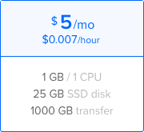

# Alley-Oop

An alley-oop is:

1. _In basketball, a shot where a player throws the ball up toward the rack, [and another player grabs it mid-air and performs a slam dunk](https://www.youtube.com/watch?v=cpfCd9fWq04)._
1. _In computer networking, a Dynamic DNS server with an integrated Let's Encrypt proxy, enabling easy HTTPS for web servers on a local network._

## Setup

This section describes getting a working demo set up. It uses `example.com` as the domain, but you should obviously **substitute that for your own domain** when going through the setup process.

1. [Getting a virtual machine](#1-getting-a-virtual-machine)
1. [Updating DNS records](#2-updating-dns-records)
1. [Preparing the machine](#3-preparing-the-machine)
1. [Running the alley-oop server](#4-running-the-alley-oop-server)
1. [Running the demo client](#5-running-the-demo-client)

### 1. Getting a virtual machine

This example will be creating a DigitalOcean droplet. You can of course **skip this step** if you already have a server you can use, or do something similar on another VPS host (e.g. Amazon EC2).

1. Create a new droplet
1. Select Docker from One-click apps, for example:

    

1. Even the cheapest droplet is plenty enough:

    

1. Make sure your SSH will be added to the machine
1. Choose a hostname, e.g. `alley-oop`
1. Create the droplet, and wait for it to be provisioned

### 2. Updating DNS records

Now, we need to make the host accessible via a domain name. Using your DNS provider of choice (e.g. Hover, Amazon Route 53, etc):

1. Create a DNS record that points to the server you just created in the previous step:

    ```
    Name:  alley-oop.example.com
    Type:  A
    Value: <IP address of the server>
    TTL:   300
    ```

1. Then, we need another record for our DNS server itself:

    ```
    Name:  lan.example.com.
    Type:  NS
    Value: alley-oop.example.com
    TTL:   300
    ```

Note that it might be tempting to have the `A` record name also be `lan.example.com`, but [due to DNS zone cuts](https://serverfault.com/a/779871), it's not possible.

### 3. Preparing the machine

We need to run a few commands on the host to make sure it can act as a DNS server. Feel free to adapt these to your particulars if you're running on a different distro, for example.

So SSH over, switch to `root`, and:

1. Open up standard HTTP(S) & DNS ports on the firewall:

    ```bash
    ufw allow 80/tcp
    ufw allow 443/tcp
    ufw allow 53/tcp
    ufw allow 53/udp
    ```

1. Disable the local DNS server, so it doesn't conflict with our new DNS server (i.e. `alley-oop`):

    ```bash
    systemctl stop systemd-resolved.service
    systemctl disable systemd-resolved.service
    ```

1. Use Google's DNS for local name resolution (or any other DNS host you prefer):

    ```bash
    echo 'nameserver 8.8.8.8' > /etc/resolv.conf
    ```

### 4. Running the `alley-oop` server

Finally, we need to configure and run `alley-oop` itself.

Using your favorite text editor (e.g. `vim`), create a file called `alley-oop.cfg` and update it to:

```ini
[auth]
username = "alley-oop"
password = "password"
[dns]
domain = "lan.example.com"
nsadmin = "admin.alley-oop.example.com"
nameservers = ["alley-oop.example.com"]
recordttl = 300
[db]
directory = "/var/lib/alley-oop"
```

**Please change the password to be a secret known only to you.** Seriously.

Now we're ready to pull and start the server itself:

```console
$ docker run --name alley-oop -d \
  -p 80:80 -p 443:443 -p 53:53/tcp -p 53:53/udp \
  -v "$(pwd)/alley-oop.cfg:/etc/alley-oop/config.cfg" \
  futurice/alley-oop:1.1.2
...
$ docker logs -f alley-oop
Starting alley-oop v1.1.2
Starting server at http://localhost:443
Starting DNS server at localhost:53
Starting server at http://localhost:80
^C
```

To check that the server is responding over the network, at the correct address, and with a valid certificate of its own, try:

```console
$ curl https://alley-oop.example.com/
alley-oop v1.1.2
```

### 5. Running the demo client

This repository ships with a demo client, which you can use to verify your server works as expected. Assuming you have a local IP address of `10.6.3.8`:

```console
$ cd demo
$ npm install
...
$ export DOMAIN_NAME=lan.example.com
$ export SERVER_NAME=alley-oop.example.com
$ export SERVER_PASSWORD=password
$ npm start
Current configuration is:

{ DOMAIN_NAME: 'lan.example.com',
  SERVER_NAME: 'alley-oop.example.com',
  SERVER_USERNAME: 'alley-oop',
  SERVER_PASSWORD: 'password',
  HTTP_PORT: 1080,
  HTTPS_PORT: 10443 }

Fetching https://alley-oop.example.com/v1/update?hostname=10-6-3-8.lan.example.com&myip=10.6.3.8

Server started! Try any of the following endpoints:

* http://10-6-3-8.lan.example.com:1080/
* https://10-6-3-8.lan.example.com:10443/
* ws://10-6-3-8.lan.example.com:1080/ws (test with http://www.websocket.org/echo.html)
* wss://10-6-3-8.lan.example.com:10443/ws (test with https://www.websocket.org/echo.html)

Fetching https://alley-oop.example.com/v1/privatekey?hostname=10-6-3-8.lan.example.com
Fetching https://alley-oop.example.com/v1/certificate?hostname=10-6-3-8.lan.example.com
```

While the server is running, you – and importantly, **anyone else on the same network** – should be greeted with a friendly, green padlock:


The demo client will register a DNS name for each private IP address available on your local interfaces. In practice, you'd more likely register a DNS entry with a more readable (and stable) name, like `my-app.lan.example.com`. The demo client can easily be adapted for that; for example:

```js
startServer({
  'my-app.lan.example.com': '192.168.1.123',
});
```

## Release

1. Ensure all docs have consistent example version (i.e. find & replace `1.1.2` in this repo)
1. Make sure all changes are pushed to GitHub `master`
1. Go on [GitHub](https://github.com/futurice/alley-oop/releases) and draft a new release with the format `v1.1.2`
1. Go on [Docker Hub](https://hub.docker.com/r/futurice/alley-oop/~/settings/automated-builds/), update the tag name, save, and use the "Trigger" button:

    

